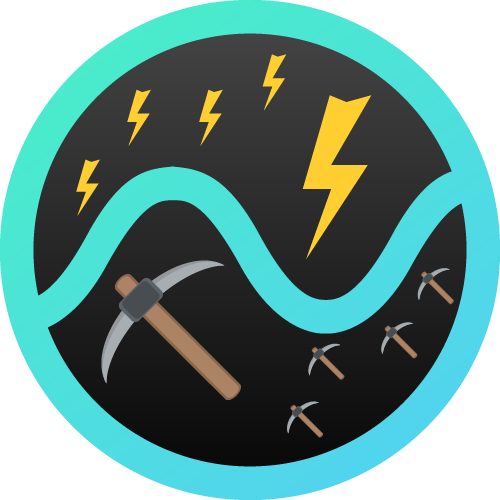

# 

# Noizio Thunder :zap: & Miner :pick:
Because we don't like be scrawed :money_with_wings:

## Thunder
Get all sounds unclocked thanks to a little "thundering" :smirk:

#### How to Thundering

1. Build from source

## Miner
Export all sounds from Noizio to `.caf` files.

## Support
| Noizio Version | Supporting |
|:-:|:-:|
| 2.0.1 | :white_check_mark:  |
| 2.0 | :white_check_mark:  |
